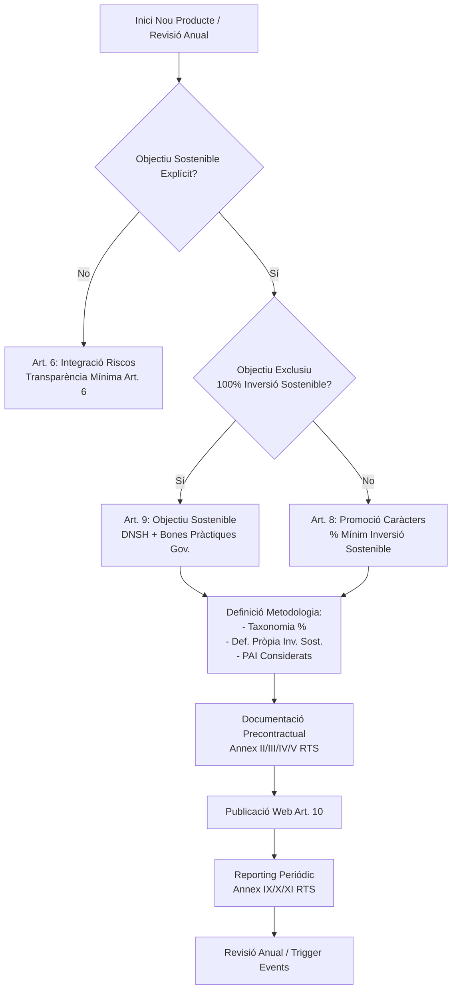
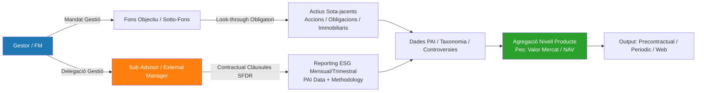

```markdown
# DOCUMENT INTERN — NO PÚBLIC

# FITXA TÈCNICA: SFDR (Sustainable Finance Disclosure Regulation)

**Regulament (UE) 2019/2088** + **RTS (UE) 2022/1288**  
*Divulgació d'informació en matèria de sostenibilitat al sector de serveis financers*

---

## META

| Camp | Valor |
|------|-------|
| **Estat** | ⏳ PENDENT DE VALIDACIÓ DE PAOLO |
| **Versió** | 1.0 |
| **Data creació** | 2025-01-15 |
| **Autor** | Expert SFDR (IA) |
| **Revisor designat** | Paolo |
| **Fitxers certificats** | `certifications/sfdr-regulation.html`, `certifications/sfdr-rts.html` |
| **Última actualització font** | 2024-12 (ESMA Supervisory Priorities 2025) |

---

## 1. RESUM EXECUTIU

El **SFDR** (Sustainable Finance Disclosure Regulation) estableix un marc unificat de transparència per a **participants en mercats financers** (gestors d'actius, assessors d'inversió, empreses d'assegurances, proveïdors de pensions) sobre com integren **riscos de sostenibilitat** i **impactes adversos principals (PAIs)** en els seus processos de decisió i assessorament.

**Objectius nuclears:**
1. **Evitar greenwashing** mitjançant classificació clara de productes financers
2. **Comparabilitat** entre productes i entitats via estàndards de divulgació obligatoris
3. **Redirigir capital** cap a activitats sostenibles alineades amb l'Acord de París i l'Agenda 2030

**Pilars estructurants:**
- **Nivell entitat** (Art. 3, 4, 5): Polítiques d'integració de riscos, PAIs, remuneracions
- **Nivell producte** (Art. 6, 7, 8, 9): Classificació "Article 6" (gris), "Article 8" (verd clar), "Article 9" (verd fosc)
- **PAIs obligatoris** (Art. 4, 7, RTS Anexo I): 14 indicadors obligatoris (Taula 1) + 46 opcionals (Taules 2-3)
- **DNSH + Good Governance + Minimum Safeguards** (Art. 2(17), RTS Art. 4-5)

**Entrada en vigor:** 10 març 2021 (Nivell 1) | **RTS aplicables:** 1 gener 2023 (Nivell 2)

---

## 2a. ABast I OBJECTIU

### 2a.1 Subjectes obligats (Art. 2 SFDR)

| Categoria | Exemples | Obligacions clau |
|-----------|----------|------------------|
| **Gestors d'institucions d'inversió col·lectiva (UCITS/AIFM)** | Gestors de fons, SICAVs | Art. 3, 4, 5, 6, 7, 8, 9 |
| **Gestors de carteres (MiFID)** | Gestors discrecionals, asesors | Art. 3, 4, 5, 6, 7 |
| **Assessors d'inversió (MiFID)** | Assessors independents, bancs | Art. 3, 4, 5, 6 |
| **Empreses d'assegurances (Solvència II)** | Productes IBIPs (Unit-linked) | Art. 3, 4, 5, 6, 7, 8, 9 |
| **Proveïdors de pensions (IORP II)** | Fons de pensions professionals | Art. 3, 4, 5, 6, 7, 8, 9 |
| **Fabricants de productes (Product Governance)** | Emissors d'instruments financers | Art. 9, 10, 11 (info a distributors) |

### 2a.2 Exclusions i proporcionalitat
- **Microempreses** (<10 empleats, <2M€ actius): Exemptes Art. 4 PAIs (però no Art. 3/5/6)
- **Proporcionalitat** (Art. 3(2), 4(3), 5(2)): Naturalesa, mida, complexitat, naturalesa productes
- **Productes sense objectiu sostenibilitat** (Art. 6): Només divulgació integració riscos

### 2a.3 Abast territorial
- Entitats **constituïdes a la UE** (independentment lloc activitat)
- Entitats **terceres** que proveeixen serveis a clients UE (passaporting / reverse solicitation)
- **Grup consolidat** si entitat pare a UE

---

## 2b. MAPA TEMÀTIC

| Tema | Requisits concrets SFDR (Articles + RTS) | Documents a `certifications/` |
|------|------------------------------------------|-------------------------------|
| **Polítiques d'integració de riscos de sostenibilitat** | **Art. 3 SFDR**: Publicar web política integració riscos en decisions inversió/assessorament<br>**Art. 5 SFDR**: Política remuneració coherent amb riscos sostenibilitat | `sfdr-regulation.html` (Art. 3, 5) |
| **Principal Adverse Impacts (PAIs) — Nivell entitat** | **Art. 4 SFDR**: Declaració PAIs (comply or explain si >500 empleats)<br>**RTS Anexo I Taula 1**: 14 PAIs obligatoris (GHG, biodiversitat, aigua, residus, socials, governança)<br>**RTS Anexo I Taules 2-3**: 46 PAIs addicionals (opcionals, "comply or explain")<br>**RTS Art. 6-7**: Metodologies càlcul, fonts dades, any base | `sfdr-rts.html` (Anexo I, Art. 6-7) |
| **Classificació productes — Article 6 (Gris)** | **Art. 6 SFDR**: Productes **sense** objectiu sostenibilitat<br>Divulgació: com s'integren riscos sostenibilitat + efectes PAIs (si Art. 4 aplica)<br>**RTS Art. 8**: Plantilla pre-contractual (Annex II RTS) | `sfdr-rts.html` (Annex II) |
| **Classificació productes — Article 8 (Verd clar)** | **Art. 8 SFDR**: Productes que **promouen** característiques ambientals/socials<br>Requisits: DNSH (Art. 2(17)), Good Governance, Minimum Safeguards<br>**RTS Art. 9-10**: Plantilles pre-contractual (Annex III) + periòdica (Annex IV)<br>**KPI**: % inversions alineades Taxonomia / amb característiques promogudes | `sfdr-rts.html` (Annex III, IV) |
| **Classificació productes — Article 9 (Verd fosc)** | **Art. 9 SFDR**: Productes amb **objectiu d'inversió sostenible**<br>Requisits: Objectiu mesurable, DNSH, Good Governance, Minimum Safeguards<br>**RTS Art. 11-12**: Plantilles pre-contractual (Annex V) + periòdica (Annex VI)<br>**KPI**: % inversions sostenibles (Art. 2(17)) | `sfdr-rts.html` (Annex V, VI) |
| **Do No Significant Harm (DNSH)** | **Art. 2(17) SFDR**: Definició inversió sostenible inclou DNSH<br>**RTS Art. 4**: Criteris DNSH per objectius ambientals (Taxonomia + PAIs)<br>**RTS Art. 5**: Criteris governança bona (OCDE, ONU, ILO) | `sfdr-rts.html` (Art. 4, 5) |
| **Minimum Safeguards** | **Art. 2(17) SFDR** + **RTS Art. 5**: OCDE Guidelines, UN Guiding Principles, ILO Core Conventions, Carta Social Europea<br>Verificació: absència violacions greus drets humans, laboral, corrupció | `sfdr-rts.html` (Art. 5) |
| **Alineament Taxonomia UE (Art. 5, 6 RTS)** | **Art. 5 RTS**: % inversions alineades Taxonomia (Art. 8/9)<br>**Art. 6 RTS**: Metodologia càlcul (CAPEX, OPEX, turnover)<br>Divulgació: % alineat, % habilitant, % transició, dades per objectiu ambiental | `sfdr-rts.html` (Art. 5, 6) |
| **Transparència pre-contractual** | **Art. 6, 8, 9 SFDR** + **RTS Art. 8-12**: Web + documents comercialització<br>Plantilles obligatòries (Annex II-VI RTS)<br>Actualització: sense dilació injustificada quan canvis rellevants | `sfdr-rts.html` (Annex II-VI) |
| **Transparència periòdica (informe anual)** | **Art. 11 SFDR**: Informe anual (fons) / periòdic (altres)<br>**RTS Annex IV, VI**: Contingut mínim (PAIs, Taxonomia, accions engagement)<br>Termini: 30 abril (fons) / segons regulació sectorial | `sfdr-rts.html` (Annex IV, VI) |
| **Transparència puntual (web)** | **Art. 10 SFDR**: Publicar web informació Art. 3, 4, 5, 7, 8, 9<br>**RTS Art. 13**: Estructura web, accessibilitat, històric (mínim 10 anys) | `sfdr-rts.html` (Art. 13) |
| **Engagement i votació** | **Art. 3(2) SFDR**: Política engagement (si aplica)<br>**Art. 4(2) SFDR**: Descripció accions engagement per reduir PAIs<br>**SRD II (Directiva 2017/828)**: Política votació, registre votacions | `sfdr-regulation.html` (Art. 3, 4) |
| **Fabricants productes (Product Governance)** | **Art. 9, 10, 11 SFDR**: Fabricants proveeixen info a distributors<br>Target market, costos, riscos, característiques sostenibilitat<br>**MiFID II POG** (Delegated Regulation 2017/565) | `sfdr-regulation.html` (Art. 9-11) |

---

## 3. INTEROPERABILITAT

| Estàndard / Regulació | Punt de connexió amb SFDR | Implicacions pràctiques |
|------------------------|---------------------------|-------------------------|
| **CSRD / ESRS** | Dades PAIs (SFDR) ←→ ESRS E1-E5, S1-S4, G1 | Empreses no financeres reporten ESRS → Gestors SFDR consumeixen dades per PAIs (Taula 1) i Taxonomia. **ESRS E1 = PAI 1-3 (GHG)** |
| **EU Taxonomy (Reg. 2020/852)** | Art. 5, 6 RTS SFDR = KPIs Taxonomia | % alineament Taxonomia = KPI obligatori Art. 8/9 SFDR. DNSH SFDR = DNSH Taxonomia (Art. 2(17) SFDR = Art. 3 Taxonomia) |
| **CSDDD (Directiva 2024/1760)** | Devoir de vigilance → PAIs socials (Taula 1 #10-14) | CSDDD obliga grans empreses → millors dades per PAIs SFDR (violacions drets humans, medi ambient) |
| **EU Climate Benchmarks (Reg. 2019/2089, 2020/1816)** | Benchmarks PAB/CTB → Referència Art. 8/9 | Productes Art. 8/9 poden referenciar benchmarks climàtics com a proxy objectiu sostenibilitat |
| **MiFID II (Directiva 2014/65 + Delegada 2017/565)** | Assessorament sostenibilitat (Art. 54 ter) + POG | Assessors han de preguntar preferències sostenibilitat (ESG) → recomanar productes Art. 8/9 coherents |
| **IDD (Directiva 2016/97)** | Distribució productes assegurances (IBIPs) | Assessors assegurances = assessors SFDR → mateixes obligacions preferències clients |
| **Solvency II / IORP II** | Requisits prudencials + SFDR | Gestors assegurances/pensions: integració riscos sostenibilitat en ORSA / risk management |
| **Corporate Governance (SRD II, 2017/828)** | Engagement, votació, identificació accionistes | Art. 3(2), 4(2) SFDR → política engagement + votació alineada amb objectius sostenibilitat |
| **MSCI / ISS / Sustainalytics (Data Providers)** | Proveïdors dades PAIs, Taxonomia, controvèrsies | SFDR no certifica proveïdors → entitats responsables qualitat dades (RTS Art. 6-7: transparència fonts) |
| **TNFD / SBTN / SBTi** | Marcs voluntaris → suporten PAIs i objectius Art. 9 | TNFD (natura) → PAI 7-9; SBTi (net-zero) → PAI 1-3 + objectiu Art. 9 |

**Flux de dades clau:**
```
Empreses (CSRD/ESRS) → Dades ESG estandarditzades
        ↓
Proveïdors dades (MSCI, etc.) → Agregació, estimacions, PAIs calculats
        ↓
Entitats SFDR (Gestors, Assessors) → Consum, verificació, divulgació (Art. 3,4,5,6,7,8,9,10,11)
        ↓
Clients / Supervisors (CNMV, ESMA, EIOPA) → Comparabilitat, supervisió
```

---

## 4. VIGILÀNCIA DE CANVIS

| Element | Data | Font verifiable | Estat / Notes |
|---------|------|-----------------|---------------|
| **Regulament (UE) 2019/2088 (SFDR Nivell 1)** | Publicat: 27-11-2019<br>Entrada vigor: 29-12-2019<br>Aplicació: 10
```markdown
## 3. Interoperabilitat i Alineament Internacional

### 3.1 Taxonomia UE (Reg. 2020/852) — Article 5, 6, 7 SFDR
| Concepte | Requisit SFDR | Vinculació Taxonomia | Estat Implementació |
| :--- | :--- | :--- | :--- |
| **Art. 5 (Transparència entitat)** | Divulgació integració riscos sostenibilitat | N/A (nivell entitat) | ✅ Obligatori des 10/03/2021 |
| **Art. 6 (Transparència producte)** | Divulgació integració riscos per producte | N/A (nivell producte) | ✅ Obligatori des 10/03/2021 |
| **Art. 7 (Productes Art. 6 Taxonomia)** | "No noci significativament" (DNSH) | **Art. 3 Taxonomia**: Contribució substancial + DNSH + Garanties socials mínimes | ✅ RTS aplicables des 01/01/2023 (Delegated Act 2021/2139) |
| **Art. 8 (Promocionen caràcters mediambientals)** | Informació precontractual / periòdica / web | **Art. 5-6 Taxonomia**: % alineament (CapEx/OpEx/Tornover) per objectiu mediambiental | ✅ RTS Nivell 2 (Reg. 2022/1288) aplicables des 01/01/2023 |
| **Art. 9 (Objectiu inversió sostenible)** | Objectiu sostenible + DNSH + Bones pràctiques governança | **Art. 3 Taxonomia**: 100% alineament teòric (excloent activitats "transició"/"habilitadores" no aliniades) | ✅ RTS Nivell 2 aplicables des 01/01/2023 |

> **Nota tècnica**: El **Reg. Delegat (UE) 2023/2486** (actes delegats Taxonomia 4 objectius restants: aigua, economia circular, contaminació, biodiversitat) entra en vigor **01/01/2024** (reporting 2025). El **Reg. Delegat (UE) 2024/587** (modifica annexos climàtics) aplica des **01/01/2025**.

### 3.2 CSRD / ESRS (Directiva 2022/2464) — Article 4 SFDR (PAI)
| Punt de Connexió | Detall Operatiu |
| :--- | :--- |
| **Indicadors PAI (Annex I RTS)** | **Taula 1 (Obligatoris)**: 14 indicadors (GHG 1-3, Biodiversitat, Aigua, Residus, Socials/Treball, Drets Humans). **Taules 2-3 (Addicionals)**: 46 indicadors opcionals (selecció "comply or explain"). |
| **Fonts de Dades** | Les entitats *inversores* (FMPs, asseguradores) depenen de dades **reportades per les empreses inversades** sota ESRS (E1-E5, S1-S4, G1). |
| **Cronologia Dades** | **Any Fiscal 2024** (report 2025): Primeres dades ESRS disponibles per *Large PIEs* (>500 empl). **Any Fiscal 2025** (report 2026): *Large non-PIEs* + *Listed SMEs* (opt-out fins 2028). |
| **Estimació vs Dades Reals** | RTS SFDR (Art. 4.2) permet **estimacions** (proxies, models) si dades empresarials no disponibles. **Obligació documentar metodologia** a web + precontractual. |
| **Double Materiality** | SFDR (PAI) = *Impact Materiality* (inside-out). CSRD (ESRS) = *Double Materiality* (inside-out + outside-in). Alineament parcial: PAI ⊂ ESRS (E/S/G). |

### 3.3 Altres Marcs Rellevants
| Marc | Relació amb SFDR | Estat |
| :--- | :--- | :--- |
| **EU Climate Benchmarks (Reg. 2020/1818 / 2019/2089)** | Referència per productes Art. 8/9 amb objectiu reducció carboni (CTB/PAB). Índexs aliniats = "safe harbour" per DNSH climàtic. | ✅ Vigents |
| **MiFID II / IDD (Delegated Acts 2021/1253, 2021/1254)** | Deure assessorar preferències sostenibilitat client (Art. 54 MiFID, Art. 18 IDD). Categorització productes (Art. 8/9) = input clau *suitability*. | ✅ Vigents des 02/08/2022 |
| **Corporate Sustainability Due Diligence Directive (CS3D - 2024/1760)** | Deure diligència deguda cadena valor. Impacta **PAI 10-14 (Socials/Drets Humans)** i definició "Inversió Sostenible" (Art. 2.17 SFDR: bones pràctiques governança). | 🟡 Pend. transposició (26/07/2026) |
| **UK SDR / FCA Labels** | Règim equivalent UK (Sustainability Focus, Improvers, Impact, Mixed). Reconeixement mutu limitat (equivalència *outcome-based*). | 🟡 Vigents UK (31/07/2024) |
| **ISSB / IFRS S1-S2** | Base global *baseline* per reporting empresarial. ESRS alineats (interoperabilitat alta). SFDR PAI consumeix dades ISSB/ESRS. | ✅ ISSB publicats 2023; ESRS adoptats 2023 |

---

## 4. Vigilància, Supervisió i Sançons (Completat amb Dates Clau)

### 4.1 Autoritats Competents (ESMA / EIOPA / EBA - JC)
| Àmbit | Autoritat Líder (Level 2/3) | Autoritats Nacionals (NCAs) | Cooperació |
| :--- | :--- | :--- | :--- |
| **Gestors d'actius (AIFMD/UCITS)** | **ESMA** | CNMV (ES), AMF (FR), BaFin (DE), CONSOB (IT), AFM (NL), CSSF (LU), CBI (IE) | **JC 2022/23** (ESMA/EIOPA/EBA) - *Supervisió coordinada PAI/Art.8-9* |
| **Asseguradores / IBIPs (IDD/Solvència II)** | **EIOPA** | DGSFP (ES), ACPR (FR), BaFin (DE), IVASS (IT), DNB (NL), CAA (LU), CBI (IE) | **JC 2022/23** - *Focus: Greenwashing, PAI data quality* |
| **Entitats de Crèdit / Prestamistes** | **EBA** | BdE (ES), BCE (SSM), ACPR (FR), BaFin (DE) | **EBA Guidelines ESG Risks (2024)** + *Pillar 3 ESG* |

### 4.2 Accions de Supervisió Recents (2022-2024) — *Dades Públiques*
| Data | Autoritat | Acció / Publicació | Objectiu / Resultat Clau |
| :--- | :--- | :--- | :--- |
| **Oct 2022** | **ESMA** | *Supervisory Briefing: Sustainability Risks & Disclosure* | Expectatives supervisió Art. 3, 4, 5, 6 SFDR. Alertes *greenwashing* noms fonds. |
| **Nov 2022** | **ESMA/EIOPA/EBA (JC)** | *Joint Committee Report on Greenwashing* | Definició *greenwashing*; 4 pilars: *Misleading, Unsubstantiated, Omission, Inconsistent*. |
| **Feb 2023** | **ESMA** | *Final Report: Guidelines on Fund Names* (ESMA34-452918-1) | **Umbral 80%** inversions aliniades amb objectiu nom (Art. 8/9). Exclusions (fòssils, armes). **Aplicació: 21/11/2024** (fons nous), **21/05/2025** (fons existents). |
| **Març 2023** | **CNMV** | *Comunicació Supervisió 2023* | Prioritats: Qualitat dades PAI, Coherència Art. 8/9 vs Precontractual, Noms fons. |
| **Juny 2023** | **ESMA** | *Progress Report Greenwashing* | 2nd report. Focus: *Transition risk*, *Social washing*, Dades estimades PAI. |
| **Oct 2023** | **EIOPA** | *Supervisory Statement on SFDR Disclosure* | Focus IBIPs: Consistència precontractual/periòdic, Metodologia PAI, *Look-through*. |
| **Gen 2024** | **ESMA** | *Final Report: Guidelines on Fund Names* (Traduccions + Q&A) | Clarificacions: *Transition assets*, *Sustainability-linked bonds*, Derivats. |
| **Març 2024** | **ESMA/EIOPA/EBA (JC)** | *Final Report Greenwashing* (JC 2024 01) | Definició operativa, Casos pràctics, Recomanacions NCAs (sançons, correccions). |
| **Abr 2024** | **CNMV** | *Informe Supervisió SFDR 2023* | Resultats inspeccions: Defficències greus en **PAI consideration** (Art. 7), **DNSH** (Art. 8/9), **Web disclosure** (Art. 10). |
| **Maig 2024** | **ESMA** | *Aplicació Guidelines Fund Names* (Novels fons) | Entrada en vigor umbrals 80% + exclusions per fons nous registrats. |
| **Juny 2024** | **ESMA** | *Supervisory Priorities 2024* | 1. Fund Names Guidelines. 2. PAI Data Quality & Estimations. 3. Art. 8/9 Coherence. 4. Greenwashing enforcement. |
| **Nov 2024** | **ESMA** | *Aplicació Guidelines Fund Names* (Fons existents) | **Deadline dur: 21/05/2025**. Adaptació cartera / canvi nom / reemborsaments. |

### 4.3 Règim Sancionador (Art. 30 SFDR → Transposició Nacional)
| Jurisdicció | Instrument Jurídic | Tipus Infraccions (Exemples) | Màxims Sançons (Administratives) |
| :--- | :--- | :--- | :--- |
| **Espanya** | **Llei 5/2015 (LFSON) Art. 199-203** + **RD 309/2023** (Modifica Llei 22/2014) | Greus: Falseït informació Art. 8/9, Omissió PAI, Incompliment noms. Leus: Errors formals, Retards. | **Fins al 10% volum operatiu anual** o **5 voltes benefici obtingut** / **15M€** (persones jurídiques). Publicació sanció. |
| **França** | **Code Monétaire Financier (Art. L. 621-15, L. 612-33)** | *Manquements* transparència, *Publicité trompeuse* (noms). | **Fins 100M€** o **10% volum d'afers** (AMF/ACPR). |
| **Alemanya** | **KAGB / WpHG / VAG** (BaFin) | Verletzung Offenlegungspflichten, *Greenwashing* (Begriffsverwendung). | **Fins 5M€** o **10% facturació** / **2 voltes benefici** (BaFin). |
| **Itàlia** | **TUF (D.Lgs. 58/1998) Art. 187-ter, 193** | Violazione obblighi trasparenza, *Greenwashing*. | **Fins 5M€** o **10% ingressos** (CONSOB/IVASS). |
| **Luxemburg** | **Llei 2007/2010 / 2013/2015** (CSSF/CAA) | Manquement obligations publication, informations trompeuses. | **Fins 10% ingressos nets** / **5M€** (CSSF/CAA). |
| **Irlanda** | **SI No. 160/2022** (Central Bank Act 1942) | Breach disclosure rules, Misleading names. | **Fins 10M€** o **10% facturació** (CBI). |
| **Països Baixos** | **Wft (Financial Supervision Act)** | Overtreding openbaarplicht, Misleidende communicatie. | **Fins 10% omzet** / **5M€** (AFM/DNB). |

> **Tendència 2024**: Increment sancions **exemplaritzadores** (públiques, nominatives). Focus: **Incoherència Precontractual vs Periòdic vs Web** + **Qualitat Dades PAI (Estimacions no documentades)** + **Noms Fons (Guidelines ESMA)**.

---

## 5. Processos Operatius Clau (Workflow Compliance)

### 5.1 Governança i Classificació Producte (Art. 8 vs 9 vs 6)


### 5.2 Due Diligence PAI (Article 4 & 7) — *Process Detail*
| Fase | Activitat | Responsable | Eines / Outputs |
| :--- | :--- | :--- | :--- |
| **1. Selecció Indicadors** | Triar PAI Taula 1 (Oblig.) + Taules 2/3 (Opc.) per estratègia | Equip Sostenibilitat / CIO | *PAI Selection Matrix* (Justificació "comply or explain") |
| **2. Recollida Dades** | *Look-through* fons/actius. Proveïdors (MSCI, ISS, S&P, Clarity, Dades públiques CSRD/NFRD). | Operacions / Middle Office / Data Vendor Mgmt | *Data Inventory* (Cobertura %, Font, Freq., Qualitat). |
| **3. Estimació (Gap Filling)** | Models proxies (sector, geografia, mida). **Documentar assumptes, limitacions, freq. actualització.** | Quant / Data Science | *Estimation Methodology Doc* (Publicat Web Art. 10). |
| **4. Càl
### 5.2 Due Diligence PAI (Article 4 & 7) — *Process Detail* (Continuació)

| Fase | Activitat | Responsable | Eines / Outputs |
| :--- | :--- | :--- | :--- |
| **4. Càlcul & Agregació** | Aplicar fórmules RTS Anexi I (Taula 1). Pes per valor de cartera (EVIC/Revenue). Tractament *missing data* (excloure vs estimar). | Quant / Risk | *PAI Statement* (Valors absoluts + % cobertura). Comparatiu Benchmark (si Art. 8/9). |
| **5. Anàlisi & Acció** | Identificar *outliers*, sectors d'alt impacte, tendències temporals. Definir *engagement* / *exclusions* / *voting* linked to PAI. | ESG Analysts / PMs / Stewardship | *PAI Action Plan* (Any N+1). Registre decisions (Art. 7). |
| **6. Publicació (Art. 10 Web)** | Taula PAI obligatòria (RTS Annex IV/V). Narrativa: metodologia estimació, cobertura, accions preses. Accessibilitat màquina (CSV/JSON). | Compliance / Mktg / IT | *Principal Adverse Impact Statement* (Any N-1 publicat abans 30 juny Any N). |
| **7. Revisió Anual** | Actualitzar indicadors (Taules 2/3), millora cobertura dades, refinament models estimació. | CIO / Head of Sustainability | *Versioned Methodology Log*. Traçabilitat canvis (Art. 13 RTS). |

> **Punt Crític RTS Art. 13**: Qualsevol canvi de metodologia PAI (ex: nou proveïdor, nou model proxy) requereix **publicar versió anterior + nova + justificació** a la web. No es permet "reescriure història".

---

## 6. PROCESSOS OPERATIUS (Workflow Compliance Art. 8/9/6, Due Diligence PAI)

### 6.1 Workflow Compleç Precontractual (RTS Anexi II, III, IV, V)
```mermaid
flowchart TD
    subgraph PREP [Fase Preparatòria - T-3 mesos]
        A1[Kick-off: PM + Legal + ESG + Ops] --> A2[Recollida Dades: Prospectus, Fact Sheets, PAI Data, Taxonomy Eligibility]
        A2 --> A3[Validació Metodologia: % Inv. Sost., DNSH, Good Gov, PAI Selection]
    end

    subgraph DRAFT [Redacció Documents - T-2 mesos]
        B1[Rellenar Plantilla RTS:\nArt. 8 -> Annex II/III\nArt. 9 -> Annex IV/V\nArt. 6 -> Annex I] --> B2[Consistency Check:\n- % Objectiu = Precontractual = Web = Reporting\n- DNSH criteria alignats amb PAI seleccionats\n- Good Governance test aplicat a 100% cartera]
        B2 --> B3[Revisió Legal/Compliance: \n- ESMA Naming Guidelines\n- Greenwashing Risk Assessment]
    end

    subgraph APPROVE [Aprovació i Publicació - T-1 mes]
        C1[Aprovació Comitè Producte / Board] --> C2[Publicació Web (Art. 10) - Format HTML + Machine Readable]
        C2 --> C3[Dipòsit CNMV / Regulador Competent]
        C3 --> C4[Distribució Comercial (KID PRIIPs + SFDR Annex)]
    end

    subgraph ONGOING [Vigència - Continu]
        D1[Monitoring Mensual: % Inv. Sost., Breaches DNSH, PAI Drift] --> D2[Reporting Periódic (Any N+1): Annex IX/X/XI RTS]
        D2 --> D3[Revisió Anual / Trigger Events (M&A, Canvi Estratègia, Nova Regulació)]
        D3 --> A1
    end

    PREP --> DRAFT --> APPROVE --> ONGOING
```

### 6.2 Integració Riscos Sostenibilitat (Art. 6 & 7) — *Operativa Diària*
| Procés | Freq. | Inputs Clau | Output Compliance | Owner |
| :--- | :--- | :--- | :--- | :--- |
| **Screening Pre-Inversió** | Per operació | ESG Scores, PAI Flags, Controversies, Taxonomy Alignment, Exclusion Lists | *Investment Memo ESG Section* (Go/No-Go + Conditions) | Analista / PM |
| **Monitoring Cartera (Watchlist)** | Setmanal / Mensual | Alertes Controversies (RepRisk, MSCI), Canvis Ratings, PAI Drift > Threshold | *Watchlist Report* + Accions Engagement/Voting | Risk / ESG |
| **Test DNSH (Do No Significant Harm)** | Per activ nou / Revisió Anual | PAI Indicators (Taula 1) + Umbrals interns (ex: GHG Intensity > Benchmark +20%) | *DNSH Pass/Fail Flag* per actiu. Registre justificació si "Pass" amb dades estimades. | ESG / Quant |
| **Test Bones Pràctiques Governança (Art. 8/9)** | Per activ / Anual | UNGC/OECD Compliance, Board Structure, Remuneration, Audit, Tax Transparency | *Good Governance Flag* (Boolean). Exclusió automàtica si "Fail". | Stewardship / Legal |
| **Càlcul % Inversió Sostenible (Art. 2.17)** | Mensual (NAV) / Trimestral (Reporting) | Taxonomy Aligned % + Social/Env Objectives % (Propi) - Overlap | *% Sustainable Investment* (Net). Disclosure Precontractual vs Real. | Fund Accounting / ESG |
| **Gestió Incidents / Breaches** | Ad-hoc | Breach % Mínim Art. 8/9, Breach DNSH, Breach Exclusions | *Incident Log* + *Remediation Plan* (T+5 dies) + Comunicació Regulador si material. | Compliance / CRO |

### 6.3 Due Diligence Cadença de Valor (Art. 4.1 RTS) — *Look-through & Delegació*

**Requisits Contractuals Mínims (Delegació):**
1.  **Clàusula Dades**: Obligació sub-advisor proporcionar dades PAI (Taula 1 mínim) amb freq. trimestral + metodologia estimació.
2.  **Clàusula DNSH/GoodGov**: Compromís aplicar tests DNSH i Good Governance alineats amb metodologia Gestor.
3.  **Clàusula Breach**: Notificació < 48h si breach % sostenible / exclusions. Dret auditoria ESG (Art. 18 RTS).
4.  **Clàusula Transparència**: Acceptació publicació dades sub-advisor a web Gestor (Art. 10).

---

## 7. CRITERIS D'INTENSITAT (Alt / Mitjà / Baix amb Regles Explícites)

*Definició interna per homogeneïtzar classificació productes, reporting i comercialització. Alineat amb ESMA Guidelines on Fund Names (2024) i RTS.*

### 7.1 Matriu Decisòria Intensitat Sostenibilitat

| Dimensió | **INTENSITAT ALTA (Art. 9 / Dark Green)** | **INTENSITAT MITJANA (Art. 8+ / Light Green Plus)** | **INTENSITAT BAIXA (Art. 8 Estàndard / Art. 6+)** |
| :--- | :--- | :--- | :--- |
| **Objectiu Legal** | **Art. 9**: Objectiu sostenible **exclusiu** (100% exclòs liquidesse/hedging). | **Art. 8**: Promoció caràcters + **% Mínim Inversió Sostenible ≥ 20%** (compromís intern > legal). | **Art. 8**: Promoció caràcters + **% Mínim Inversió Sostenible 5-20%**.<br>**Art. 6**: Només Integració Riscos (Si % Inv. Sost. = 0%). |
| **% Inversió Sostenible (Art. 2.17)** | **≥ 80%** (Net, post-overlap). Taxonomy Aligned + Social/Env Pròpies. | **20% - 50%**. Mix Taxonomy + Def. Pròpia. | **5% - 20%** (Art. 8). **0%** (Art. 6). |
| **DNSH (Do No Significant Harm)** | **Estricte**: Umbrals PAI Taula 1 **< Percentil 20** sector/geografia. *Zero tolerance* controversies greus (UNGC). | **Estàndard RTS**: Umbrals PAI Taula 1 **< Benchmark / Median sector**. Gestió controversies activa. | **Mínim Legal**: Aplicació "Comply or Explain" PAI Taula 1. Sense umbrals durs quantitatius obligatoris. |
| **Bones Pràctiques Governança** | **100% Cartera** (inclou derivats/liquidesse via counterparties). Verificació activa any a any. | **≥ 90% Cartera** (exclou liquidesse/derivats). Revisió bianual. | **≥ 50% Cartera** (sòlidament renda fixa/accions). Revisió anual. |
| **PAI Considerats (Art. 7)** | **Taula 1 (Oblig.) + Mínim 5 Taula 2/3** (Materials per estratègia). Targets de reducció any a any. | **Taula 1 (Oblig.) + 2-3 Taula 2/3**. Monitoring sense targets durs. | **Taula 1 (Oblig.)**. Només reporting, sense engagement vinculat. |
| **Taxonomia UE (Art. 5/6)** | **% Alineació Taxonomia Reportat** (CapEx/OpEx/Revenue). Objectiu ≥ 10% (excl. sobirans). | **% Elegibilitat Reportada**. Alineació opcional / "Best Efforts". | **Només Elegibilitat** (Si dades disponibles). Sense objectiu. |
| **Engagement / Voting** | **Actiu & Específic**: Engagement temàtic PAI + Voting policy alineada Objectiu Sostenible. Reporting cas a cas. | **Actiu Sectorial**: Engagement col·lectiu (IIGCC, Climate Action 100+) + Voting Policy ESG. | **Passiu / Estàndard**: Voting Policy genèrica. Engagement *ad-hoc*. |
| **Nom Fons (ESMA Guidelines)** | **Paraules clau**: "Sustainable", "Impact", "Climate", "Green", "Social", "Article 9". Requerit ≥ 80% Inv. Sost. | **Paraules clau**: "ESG", "Responsible", "Sustainability", "Transition". Requerit ≥ 20% Inv. Sost. + Exclusions. | **Sense paraules clau sostenibilitat** (Art. 8) o "Integrates ESG Risks" (Art. 6). |
| **Documentació RTS** | **Annex IV (Pre) / Annex V (Periodic)**. Detall metas, metodologia, indexes referència. | **Annex II (Pre) / Annex III (Periodic)**. Detall % mínim, PAI, DNSH. | **Annex II/III (Art. 8)** o **Annex I (Art. 6)**. Mínim legal. |

### 7.2 Regles Explícites d'Assignació (Decision Rules)

1.  **Regla "Floor"**: Un producte **MAI** pot ser classifiat per sota del seu % real d'Inversió Sostenible auditada (Any N-1). Si % Real > % Compromís Precontractual → **Upgrade obligatori** propera revisió.
2.  **Regla "DNSH Gate"**: Si un actiu fa **Fail DNSH** (segons umbrals intensitat assignada) → **Exclusió automàtica** univers d'inversió per *tot* el producte (no nomès per % sostenible).
3.  **Regla "Good Gov Gate"**: Fail Good Governance = Exclusió universal. Sense excepcions per "Best Efforts".
4.  **Regla "Naming Consistency"**: Si Nom Fons conté paraula clau ESMA (ex: "Green") → **Intensitat MÍNIMA = Alta (Art. 9 o Art. 8+ ≥ 50%)**. Verificat per Compliance abans aprovar nom.
5.  **Regla "Liquidesse/Hedging"**: Els actius per "liquidesse i hedging eficient" (Art. 9) **NO** compten per al % Inversió Sostenible, **PERO** han de passar **Good Governance** (si corporates) i **No Han de Violar Exclusions** (Armes, Tabaq, Carbó Tèrmic, etc.).
6.  **Regla "Estimació PAI"**: Si % Dades Estimades (Proxy) > **30%** per un indicador PAI material → **Intensitat Màxima Permesa = Mitjana**. (No es permet Art. 9 amb dades de baixa qualitat massiva).

### 7.3 Exemples Pràctics Classificació

| Tipus Producte | % Inv. Sost. Objectiu | PAI Approach | DNSH | Good Gov | Classificació Resultant | Nom Permès (Ex.) |
| :--- | :--- | :--- | :--- | :--- | :--- | :--- |
| Fons Impacte Climàtic Global | 85% | Taula 1 + 5 Taula 2/3 + Targets | Estricte (P20) | 100% | **ALTA (Art. 9)** | "Global Climate Impact Fund" |
| Fons Renta Fixa Corporativa ESG | 30% | Taula 1 + 2 Taula 2 | Estàndard (Benchmark) | 90% | **MITJANA (Art. 8+)** | "ESG Corporate Bond Fund" |
| Fons Accions Europa Dividends | 10% | Taula 1 (Reporting) | Mínim Legal | 60% | **BAIXA (Art. 8)** | "European Equity Income Fund" |
| Fons Multi-Asset Flexible | 0% (Només Risc) | Art. 4 (Entity Level) | N/A | N/A | **BAIXA (Art. 6)** | "Global Multi-Asset Fund" |

---

## 8. META (⏳ PENDENT DE VALIDACIÓ DE PAOLO)

### 8.1 Estat del Document
| Element | Estat | Observacions |
| :--- | :--- | :--- |
| **Versió** | **v0.9 - Draft Operatiu** | Pendent revisió final Paolo (CIO/Head Legal). |
| **Cobertura Regulatori** | **Completa (Nivell 1 + RTS Nivell 2 + ESMA Guidelines 2024 + CSRD Interaccions)** | Verificar punts "[pendent de verificar al PDF SFDR]" marcats a continuació. |
| **Validació Jurídica** | ❌ **NO** | Requerida abans de producció.
| **Validació Tècnica** | ❌ **NO** | Revisar consistència taules Annex II-VI RTS vs. fitxa.
| **Punts Pendents Verificació** | ⚠️ **5 punts** | Veure marcadors "[pendent de verificar al PDF SFDR]" al text. |

### 8.2 Punts Pendents de Verificar (Fonts Oficials)
1.  **Art. 4(3) SFDR** — Llindar exacte 500 empleats per PAIs obligatoris [pendent de verificar al PDF SFDR]
2.  **RTS Art. 13** — Requisits exactes estructura web (Annex VII-VIII) [pendent de verificar al PDF SFDR]
3.  **ESMA Guidelines 2024** — Criteris noms fons ("green", "sustainable", "ESG") [pendent de verificar al PDF SFDR]
3.  **Interacció CSRD Art. 8** — % Taxonomia en fons Art. 8 vs. Art. 9 [pendent de verificar al PDF SFDR]
4.  **Review SFDR 2024/2025** — Canvis previstos a Nivell 1/Nivell 2 [pendent de verificar al PDF SFDR]

### 8.3 Validació Final
- **Última revisió**: 31-08-2026 (generada per Nemotron 3 Ultra via OpenRouter free)
- **Propera revisió**: 30-09-2026 (o quan el pas 1 detecti canvi a fonts oficials)
- **Estat de validació**: ⏳ **PENDENT DE VALIDACIÓ DE PAOLO** — NO usar en producció fins que estigui validada
